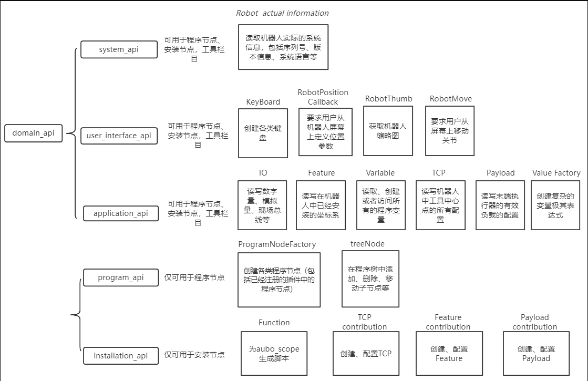

# 插件开发疑难点讲解：

## 目录：

> 一、插件开发的目的与任务
>
> 二、插件开发的模板结构
>
> 三、具体的开发流程
>
> 四、插件的打包和载入
>
> 五、插件开发的调试
>
> 六、插件资源的加载
>
> 七、插件内使用键盘
>
> 八、插件翻译的实现
>
> 九、插件demo示例

### 一、插件开发的目的与任务：

#### 1、插件开发的目的:

为什么要进行插件开发: 我们可以这样想，假设离开插件，我们的机械臂实质上并不能完成什么功能。当插件与机械臂结合后，机械臂提供运动控制，插件提供插件特有的功能。

#### 2、了解`arcs`工作流程：

- 插件是运行在示教器上的，那么插件就有一部分功能（主要在程序节点中）需要配合示教器软件进行，了解arcs软件是必要的
- 我们arcs软件与机械臂的沟通是通过脚本来控制的，大体上的流程是：用户在线编程或者进行配置相关参数->记录aubo_scope中->aubo_scope产生脚本文件->aubo_scope将所有脚本文件一同发送给aubo_control->机械臂执行相关操作。（这里讲到的**aubo_scope**和**aubo_control**，是指arcs软件，我们的arcs软件架构主要分为这两部分）

#### 3、插件开发的主体任务：

总的来讲是何时何地执行物体的具体功能

> 在现有的架构下，我们具体要实现的内容是：
>
> 安装节点（配置执行具体功能所需要的参数）
>
> 程序节点（根据参数生成脚本执行具体功能）

arcs软件与机械臂的沟通是通过脚本来控制的，插件的一部分功能（程序节点）需要配合机械臂进行工作。这里的重点是什么，脚本。我们需要为机械臂控制器提供来自插件的脚本。在aubo_scope中脚本来自于程序节点与安装节点，所以我们插件开发的主体任务是完成插件的安装节点与程序节点模块。

- 安装节点：

  安装节点，顾名思义，重在安装（和其他软件的安装一样，安装一个东西就需要把所有配置都获取到，并且安装只能安装一次）同理，我们插件的安装节点（以及arcs软件的内置安装节点）主要负责对该插件的各类参数的配置，并将配置保存下来。（举个例子，比如焊接插件：我们要起弧就需要配置准备时间、送气时间、电流电压等等参数，而安装节点就负责对这些参数的设置）。需要注意的是安装节点只在程序中实例化一次，因为参数是一个全局性的的概念，后续对实体机的操作都是基于此参数。所以只需要实例化一次，这样可以大大优化运行效率。

- 程序节点：

  程序节点目的是：在特定时间执行具体的功能，比如机械臂移动到某一点的时候，在该点设置一个程序节点负责打开抓手；机械臂移动到另一个节点的时候，设置一个程序节点负责关闭抓手。

### 二、插件开发的模板结构：

1. 模板结构图：

   提供一份完整的插件模板内容的UML图

2. 各类API内容:

   > 概述：
   >
   > 
   >
   > 详细的接口极其注释：[aubo_capsAPI总览](aubo_caps_ API.md)

3. 在插件中对这些接口的具体使用方式：

   具体使用请参考demo源码中的使用，这里只阐述结构。

   - 安装节点**node**类中的**api_provider_**接口的内容以及使用:

     > 内容：`systemApi`、 `userInterfaceApi`、`installationApi`

   - 程序节点**contribution**类中的**api_provider_**接口的内容以及使用:

     > 内容：`systemApi`、`userInterfaceApi`、`programApi`

   - 安装节点和程序节点**view**类中**view_api_**接口的内容以及使用:

     > 内容：`systemApi`、`userInterfaceApi`

   - 向`DataModel`存取数据的方式：

     > （这里保存的配置数据在aubo_scope启动时后会加载到dataModel中，数据保存在arcs_ws/program文件夹下）可调用接口   DataModelPtr model_{ nullptr }     该接口在installation和program中分别各自提供了一个。该接口的使用方式为（需要添加头文件#include "aubo_caps++/meta_type.h"）：    DECLARE_ATTR(名称，类型，初始值)，使用这种方式即可将该项数据存放到datamodel中（需注意这里的类型只提供部分类型，使用时可转到定义处自行了解）。

### 三、具体的开发流程：

为了便于以及简化插件开发流程，我们做了一个开发模板。利用该开发模板，我们可以直接将插件集成到`aubo_scope`中，并且完成了`aubo_caps`的基本架构。我们只需要在此模板基础上完善内容即可。

开发模板地址：[http://git.aubo-robotics.cn:8001/aubo_plus/template.git](http://git.aubo-robotics.cn:8001/aubo_plus/template.git)

该模板的使用：可查看模板下载地址处的`README.md`文件

### 四、插件的打包与载入：

- 注意第一次载入某个插件，必须将插件打包成zip文件，然后将打包后的文件复制到`aubo_scope`工作目录下（arcs_ws）

- 后续若要更新`aubo_scope`中的插件，只需要更新`arcs_ws/extensions`文件夹下对应插件的内容即可（此处可参考下列调试方案中的配置）

### 五、插件开发过程中的调试：

由于插件的运行需要将插件加载到aubo_scope中，所以遵循一定的调试方案能让开发效率大大提高。

> - 首先将插件加载到aubo_scope中，然后将插件生成的库文件路径直接改到aubo_scope解压插件的目录下，这样每次编译插件，都会更新aubo_scope读取的插件库文件(具体操作方法参考下方的调试方案文档)。

调试方案参考文档：[http://git.aubo-robotics.cn:8001/arcs/application_notes/-/tree/master/04-plugin_debug](http://git.aubo-robotics.cn:8001/arcs/application_notes/-/tree/master/04-plugin_debug)

### 六、插件资源的加载：

在插件中若要使用图标等。

资源加载参考文档：[02-plugin_load_resource · master · arcs / application_notes · GitLab (aubo-robotics.cn)](http://git.aubo-robotics.cn:8001/arcs/application_notes/-/tree/master/02-plugin_load_resource)

### 七、插件键盘的使用：

键盘使用文档：[10_plugin_keyboard · master · arcs / application_notes · GitLab (aubo-robotics.cn)](http://git.aubo-robotics.cn:8001/arcs/application_notes/-/tree/master/10_plugin_keyboard)

### 八、插件翻译的实现：

插件翻译参考文档：[03-plugin_translation · master · arcs / application_notes · GitLab (aubo-robotics.cn)](http://git.aubo-robotics.cn:8001/arcs/application_notes/-/tree/master/03-plugin_translation)

### 九、插件demo示例：

